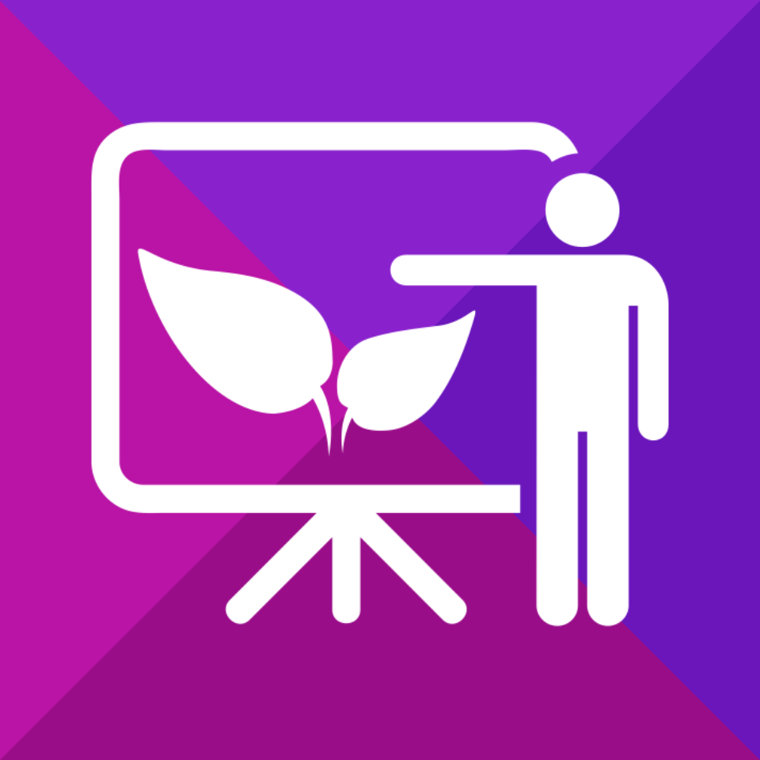

# StreamPoint
####MHacks V

Lecturers often have to invest huge amounts of time in order to build simple slide decks for presentations. Our app uses Natural Language Processing and Machine Translation through a Web App in order to generate slides on the fly as a speaker talks. By using Entity Extraction and Sentiment Analysis through the AlchemyAPI library, we are able to accurately construct structured slides that are topical to your talk!

Using vocal transcription and NLP, streampoint generates a slidedeck for the presenter as he tells his story. With content powered by the Bing Image API, Stream, WolframAlpha, and Azure, we enable you to show the audience your ideas without looking up anything, demonstrate physical components without passing anything around, and impress your crowd without memorizing (or knowing for that matter) a single fact.

##iOS App
Our mobile application takes your location and automatically aggregates the closest clinics that have your required medication. Information is accurate and up-to-date so that you can rest easy!

##Web App
Our web app uses jquery libraries in order to create a slide interface that includes a macro view of your presentation, different presentation layouts and settings, and options for dynamic features.

##Backend
Need to add write up.

##Check Us Out

Git Repo: https://github.com/MAKE-UIUC/BHChi15
Devpost: http://devpost.com/software/streampoint

We hope our app can be applied to make your world a flashier place!

